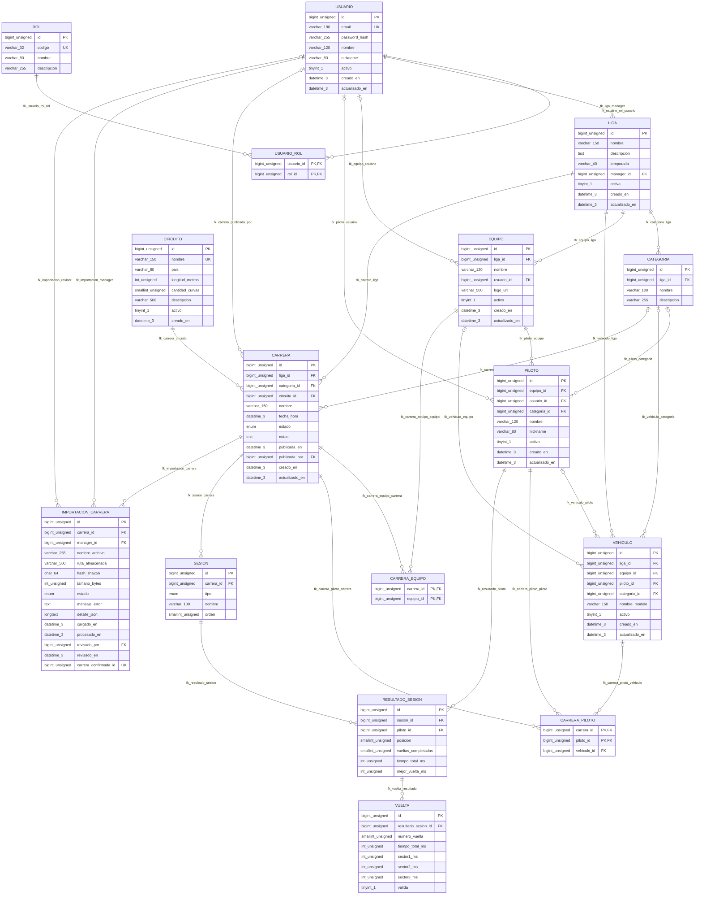

# RaceManager — Esquema de base de datos

**Motor:** MySQL 8.0.16+ (InnoDB; restricciones `CHECK`).  
**Versión actual:** **3**, conforme al esquema de creación y a las migraciones `002` y `003`.  
**Fuente de verdad:** [`database/schema.sql`](../../database/schema.sql). Este documento representa el diseño existente; no modifica tablas.

## Creación y migraciones

- **Base nueva:** ejecutar `database/schema.sql`. El esquema actual ya incluye `importacion_carrera.detalle_json`; no aplicar migraciones encima de esta versión.
- **Base v1:** realizar respaldo y aplicar **en orden** `database/migraciones/002_importacion_y_publicacion.sql` y `database/migraciones/003_detalle_importacion.sql`.
- **Base v2:** realizar respaldo y aplicar **solo** la migración `003`, que agrega `detalle_json LONGTEXT NULL` para almacenar la previsualización normalizada del importador.
- Datos opcionales para desarrollo: `database/datos-desarrollo.sql` (no usar en producción).

## Diagrama entidad-relación completo

El DDL actual contiene **16 tablas, 112 campos, 29 claves foráneas y 23 índices explícitos adicionales a las claves primarias**. El siguiente DER representa todos los campos y todas las relaciones; incluye las tablas intermedias `usuario_rol`, `carrera_equipo` y `carrera_piloto`.

**Convenciones:** `bigint_unsigned`, `int_unsigned` y `smallint_unsigned` preservan los tipos sin signo de MySQL; `varchar_150` y `datetime_3` indican longitud/precisión sin paréntesis para compatibilidad con Mermaid. `PK`, `FK` y `UK` designan primaria, foránea y unicidad de columna individual (no se marcan como únicas las columnas que solo forman parte de un índice compuesto). `||--o{` corresponde a FK obligatoria y `o|--o{` a FK opcional. Los valores exactos de `ENUM`, nulos, valores por defecto y restricciones `CHECK` están en el DDL. La columna calculada `carrera_confirmada_id` se describe más abajo.

## Relaciones entre tablas

| Tabla hija | Claves foráneas del esquema |
|---|---|
| `rol` | — |
| `usuario` | — |
| `usuario_rol` | `fk_usuario_rol_usuario`: `usuario_id` → `usuario.id` `fk_usuario_rol_rol`: `rol_id` → `rol.id` |
| `liga` | `fk_liga_manager`: `manager_id` → `usuario.id` |
| `categoria` | `fk_categoria_liga`: `liga_id` → `liga.id` |
| `equipo` | `fk_equipo_liga`: `liga_id` → `liga.id` `fk_equipo_usuario`: `usuario_id` → `usuario.id` |
| `piloto` | `fk_piloto_equipo`: `equipo_id` → `equipo.id` `fk_piloto_usuario`: `usuario_id` → `usuario.id` `fk_piloto_categoria`: `categoria_id` → `categoria.id` |
| `vehiculo` | `fk_vehiculo_liga`: `liga_id` → `liga.id` `fk_vehiculo_equipo`: `equipo_id` → `equipo.id` `fk_vehiculo_piloto`: `piloto_id` → `piloto.id` `fk_vehiculo_categoria`: `categoria_id` → `categoria.id` |
| `circuito` | — |
| `carrera` | `fk_carrera_liga`: `liga_id` → `liga.id` `fk_carrera_categoria`: `categoria_id` → `categoria.id` `fk_carrera_circuito`: `circuito_id` → `circuito.id` `fk_carrera_publicada_por`: `publicada_por` → `usuario.id` |
| `carrera_equipo` | `fk_carrera_equipo_carrera`: `carrera_id` → `carrera.id` `fk_carrera_equipo_equipo`: `equipo_id` → `equipo.id` |
| `carrera_piloto` | `fk_carrera_piloto_carrera`: `carrera_id` → `carrera.id` `fk_carrera_piloto_piloto`: `piloto_id` → `piloto.id` `fk_carrera_piloto_vehiculo`: `vehiculo_id` → `vehiculo.id` |
| `sesion` | `fk_sesion_carrera`: `carrera_id` → `carrera.id` |
| `resultado_sesion` | `fk_resultado_sesion`: `sesion_id` → `sesion.id` `fk_resultado_piloto`: `piloto_id` → `piloto.id` |
| `vuelta` | `fk_vuelta_resultado`: `resultado_sesion_id` → `resultado_sesion.id` |
| `importacion_carrera` | `fk_importacion_carrera`: `carrera_id` → `carrera.id` `fk_importacion_manager`: `manager_id` → `usuario.id` `fk_importacion_revisor`: `revisado_por` → `usuario.id` |

Las FK anulables tienen participación opcional: no obligan a crear un registro relacionado cuando su columna admite `NULL`.

## Índices declarados

Esta tabla registra índices explícitos definidos en `schema.sql`. Cada clave primaria es también un índice único, pero se muestra únicamente en PRIMARY KEY. MySQL/InnoDB puede crear otros índices de soporte para las FK, que no se confunden aquí con índices declarados expresamente.

| Tabla | PRIMARY KEY | UNIQUE KEY adicionales | KEY explícitos |
|---|---|---|---|
| `rol` | `id` | `uk_rol_codigo` (`codigo`) | — |
| `usuario` | `id` | `uk_usuario_email` (`email`) | — |
| `usuario_rol` | `usuario_id, rol_id` | — | — |
| `liga` | `id` | — | `ix_liga_manager` (`manager_id`) |
| `categoria` | `id` | `uk_categoria_liga_nombre` (`liga_id, nombre`) | — |
| `equipo` | `id` | `uk_equipo_liga_nombre` (`liga_id, nombre`) | `ix_equipo_usuario` (`usuario_id`) |
| `piloto` | `id` | `uk_piloto_equipo_nickname` (`equipo_id, nickname`) | `ix_piloto_usuario` (`usuario_id`) `ix_piloto_categoria` (`categoria_id`) |
| `vehiculo` | `id` | — | `ix_vehiculo_liga` (`liga_id`) `ix_vehiculo_equipo` (`equipo_id`) `ix_vehiculo_piloto` (`piloto_id`) |
| `circuito` | `id` | `uk_circuito_nombre` (`nombre`) | — |
| `carrera` | `id` | — | `ix_carrera_liga_fecha` (`liga_id, fecha_hora`) `ix_carrera_estado` (`estado`) |
| `carrera_equipo` | `carrera_id, equipo_id` | — | — |
| `carrera_piloto` | `carrera_id, piloto_id` | — | `ix_carrera_piloto_vehiculo` (`vehiculo_id`) |
| `sesion` | `id` | `uk_sesion_carrera_orden` (`carrera_id, orden`) | — |
| `resultado_sesion` | `id` | `uk_resultado_sesion_piloto` (`sesion_id, piloto_id`) | `ix_resultado_piloto` (`piloto_id`) |
| `vuelta` | `id` | `uk_vuelta_resultado_numero` (`resultado_sesion_id, numero_vuelta`) | — |
| `importacion_carrera` | `id` | `uk_importacion_carrera_hash` (`carrera_id, hash_sha256`) `uk_importacion_una_confirmada` (`carrera_confirmada_id`) | `ix_importacion_carrera` (`carrera_id`) |

**Restricciones principales:**

- `ck_carrera_publicacion`: una carrera `PUBLICADA` debe tener `publicada_en` y `publicada_por`.
- `uk_importacion_carrera_hash (carrera_id, hash_sha256)`: evita cargar dos veces el mismo archivo en **una misma carrera**.
- `carrera_confirmada_id` es una columna calculada y almacenada (`STORED`), igual a `carrera_id` solo si la importación está `CONFIRMADA`. Junto con `uk_importacion_una_confirmada` limita a una importación confirmada por carrera.
- **Migración 003:** `detalle_json LONGTEXT NULL`, vista previa normalizada del resultado; no se almacena el archivo original.

## Agrupación funcional

| Tablas | Propósito |
|---|---|
| `rol`, `usuario`, `usuario_rol` | Identidad y roles |
| `liga`, `categoria`, `equipo`, `piloto`, `vehiculo` | Organización y participantes |
| `circuito`, `carrera`, `carrera_equipo`, `carrera_piloto` | Calendario e inscripciones |
| `sesion`, `resultado_sesion`, `vuelta` | Clasificaciones y cronometraje |
| `importacion_carrera` | Recepción, previsualización y auditoría |

## Estados y alcance implementado

- Carrera: `PROGRAMADA` → `CARGADA` → `PUBLICADA`, o `CANCELADA`. La base exige auditar la publicación; **el servicio de publicación aún no está implementado**.
- Importación: `PENDIENTE` → `PROCESADA` → `CONFIRMADA` o `RECHAZADA`; `ERROR` para fallos. El backend recibe, valida y almacena la vista previa en `PROCESADA`. Siguen pendientes la correspondencia de pilotos, la confirmación transaccional y la publicación.
- El parser se probó con una muestra histórica anonimizada; todavía falta contrastarlo con resultados recientes de una liga real.

## Decisiones pendientes

- `piloto.equipo_id` es obligatorio en el esquema. El equipo debe decidir si admitirá pilotos sin equipo o cambios de equipo entre temporadas.
- Definir correspondencia verificable entre `CarId` del archivo y un piloto registrado; no inferir identidades solo por nombres.
- Definir política de consulta y corrección de resultados publicados.

**Referencias:** [módulos y prioridades](../arquitectura/modulos.md) · [alcance del MVP](../mvp/alcance-mvp.md) · [guía del importador](../importacion/importador-ac-servidor.md).
