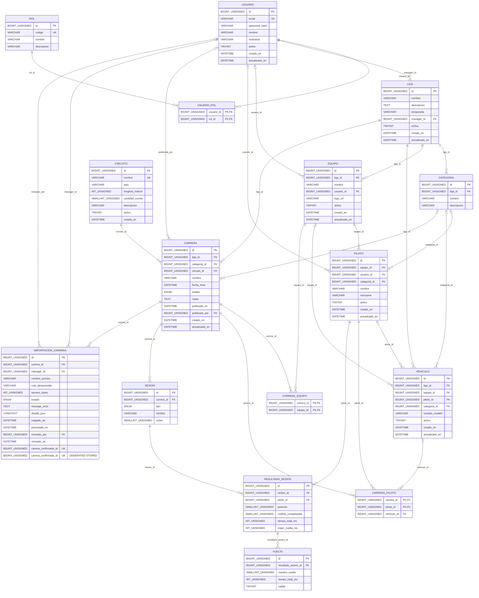

# RaceManager — Esquema de Base de Datos

**Motor:** MySQL 8.x  
**Script:** [`database/schema.sql`](../../database/schema.sql)  
**Versión:** 3 (documentación actualizada tras migración `003_detalle_importacion.sql`; conserva diseño de la 2.ª entrega)

## Cómo aplicarlo

```bash
mysql -u root -p < database/schema.sql
```

O desde MySQL Workbench: abrir y ejecutar `database/schema.sql`.

Para una base creada con la versión 1: aplicar, en orden y una sola vez, `database/migraciones/002_importacion_y_publicacion.sql` y `database/migraciones/003_detalle_importacion.sql`. Para bases ya migradas a v2, aplicar solo la 003. En una instalación nueva `database/schema.sql` incluye ambas modificaciones.
Datos de ejemplo para desarrollo: `database/datos-desarrollo.sql`.

## Diagrama entidad-relación completo

Diagrama lógico derivado del DDL vigente: **16 tablas**, sus campos y tipos, claves primarias y foráneas. Las claves compuestas se identifican marcando cada campo `PK`; `UK` indica unicidad de un campo y las claves únicas compuestas figuran en la tabla de índices. La cardinalidad opcional en las relaciones indica que la clave foránea admite `NULL`; el diagrama no reemplaza las restricciones exactas del SQL. `carrera_confirmada_id` es una columna generada almacenada (`STORED`), no una FK.



### Índices secundarios y restricciones únicas

Todas las tablas tienen su clave primaria (simple o compuesta) definida en `database/schema.sql`. Este cuadro recoge los índices secundarios **declarados explícitamente**; InnoDB puede crear índices auxiliares para las FK sin índice adecuado.

| Tabla | Índice | Columnas | Tipo |
|---|---|---|---|
| `rol` | `uk_rol_codigo` | `codigo` | Único |
| `usuario` | `uk_usuario_email` | `email` | Único |
| `liga` | `ix_liga_manager` | `manager_id` | No único |
| `categoria` | `uk_categoria_liga_nombre` | `liga_id, nombre` | Único |
| `equipo` | `uk_equipo_liga_nombre` | `liga_id, nombre` | Único |
| `equipo` | `ix_equipo_usuario` | `usuario_id` | No único |
| `piloto` | `uk_piloto_equipo_nickname` | `equipo_id, nickname` | Único |
| `piloto` | `ix_piloto_usuario` | `usuario_id` | No único |
| `piloto` | `ix_piloto_categoria` | `categoria_id` | No único |
| `vehiculo` | `ix_vehiculo_liga` | `liga_id` | No único |
| `vehiculo` | `ix_vehiculo_equipo` | `equipo_id` | No único |
| `vehiculo` | `ix_vehiculo_piloto` | `piloto_id` | No único |
| `circuito` | `uk_circuito_nombre` | `nombre` | Único |
| `carrera` | `ix_carrera_liga_fecha` | `liga_id, fecha_hora` | No único |
| `carrera` | `ix_carrera_estado` | `estado` | No único |
| `carrera_piloto` | `ix_carrera_piloto_vehiculo` | `vehiculo_id` | No único |
| `sesion` | `uk_sesion_carrera_orden` | `carrera_id, orden` | Único |
| `resultado_sesion` | `uk_resultado_sesion_piloto` | `sesion_id, piloto_id` | Único |
| `resultado_sesion` | `ix_resultado_piloto` | `piloto_id` | No único |
| `vuelta` | `uk_vuelta_resultado_numero` | `resultado_sesion_id, numero_vuelta` | Único |
| `importacion_carrera` | `ix_importacion_carrera` | `carrera_id` | No único |
| `importacion_carrera` | `uk_importacion_carrera_hash` | `carrera_id, hash_sha256` | Único |
| `importacion_carrera` | `uk_importacion_una_confirmada` | `carrera_confirmada_id` | Único |

### Reglas de integridad destacadas

- `uk_importacion_carrera_hash`: evita volver a cargar el mismo SHA-256 en una carrera.
- `uk_importacion_una_confirmada` sobre la columna calculada `carrera_confirmada_id`: como máximo una importación `CONFIRMADA` por carrera.
- `ck_carrera_publicacion`: exige `publicada_en` y `publicada_por` cuando el estado es `PUBLICADA`. La verificación de que exista importación confirmada corresponde a la lógica de publicación **pendiente**, no al `CHECK`.
- Pertenencia entre entidades de la misma liga (por ejemplo, que el piloto asignado a una carrera pertenezca a esa liga): requiere validación transaccional en la aplicación; las FK simples no garantizan por sí solas esa consistencia.

## Tablas principales

| Tabla | Propósito |
|---|---|
| `rol` / `usuario` / `usuario_rol` | Identidad y roles (ADMIN, MANAGER, EQUIPO, PILOTO) |
| `liga` / `categoria` | Competencias y categorías internas |
| `equipo` / `piloto` / `vehiculo` | Planteles y autos |
| `circuito` | Catálogo de pistas |
| `carrera` | Calendario y estados de publicación |
| `carrera_equipo` / `carrera_piloto` | Participantes |
| `sesion` / `resultado_sesion` / `vuelta` | Resultados y tiempos |
| `importacion_carrera` | Auditoría de archivos Assetto Corsa |

## Estados de carrera

`PROGRAMADA` → `CARGADA` → `PUBLICADA` (o `CANCELADA`)

- `CARGADA`: hay resultados importados y confirmados, visibles solo para el Manager de la liga.
- `PUBLICADA`: visible para equipos y pilotos. La base exige registrar `publicada_en` y
  `publicada_por` (restricción `ck_carrera_publicacion`), de modo que toda publicación queda auditada.

## Estados de importación

`PENDIENTE` → `PROCESADA` → `CONFIRMADA` | `RECHAZADA` (o `ERROR` si el archivo es inválido)

| Regla | Cómo se garantiza |
|---|---|
| El mismo archivo no se carga dos veces para la misma carrera | `UNIQUE (carrera_id, hash_sha256)` |
| Una carrera tiene como máximo una importación confirmada | Columna calculada `carrera_confirmada_id` + `UNIQUE` |
| Solo se publica lo revisado | La aplicación publica únicamente carreras con una importación `CONFIRMADA` |
| Nada queda a medias | Pendiente: la confirmación y la escritura de resultados deberán ejecutarse en una sola transacción; hoy solo se persiste la previsualización |

**Comportamiento previsto, todavía no implementado:** las correcciones de resultados confirmados requerirán un flujo explícito de revisión. El rechazo de resultados ya publicados y la detección del mismo archivo en carreras distintas se definirán en esa iteración.

## Decisiones pendientes del modelo

- **Piloto sin equipo o con cambio de equipo entre temporadas:** hoy `piloto.equipo_id` es obligatorio.
  Definir con el equipo antes de mapear la entidad JPA.
- **Correspondencia con archivos reales:** no ampliar `sesion`, `resultado_sesion` ni `vuelta`
  hasta validar las muestras históricas ya incorporadas con archivos recientes de una liga real (ver `docs/importacion/relevamiento-archivos.md`).
